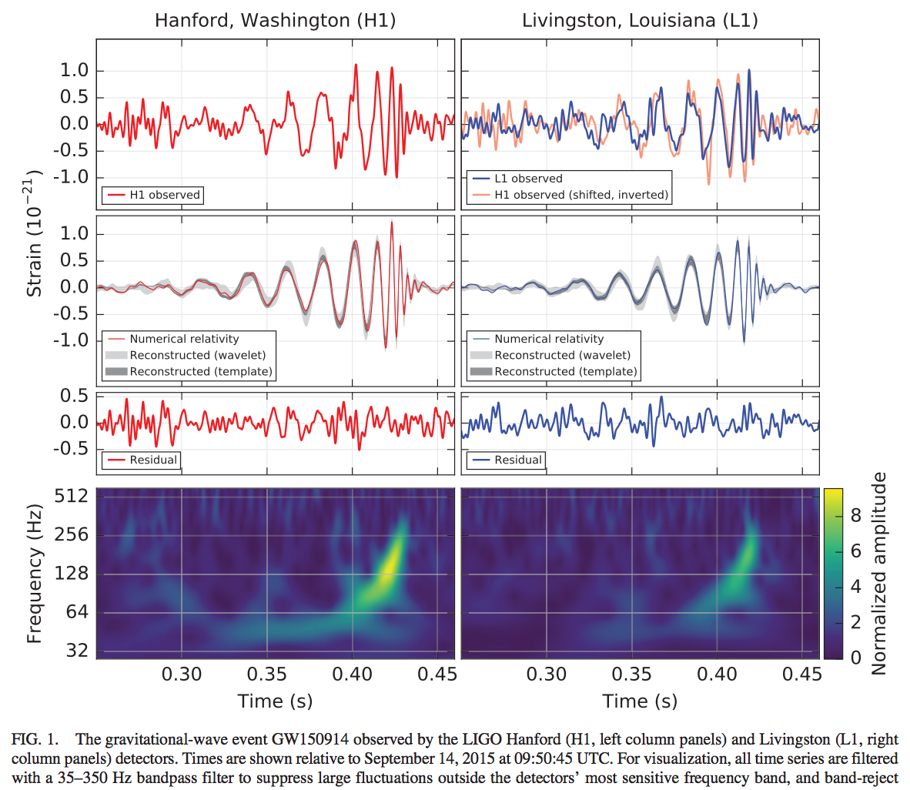

# LIGO, the 2017 Nobel prize in physics, and wrapping up Makefiles

The 2017 Nobel Prize in physics was awarded this week to three leads of the LIGO collaboration for the [discovery of gravitational waves](https://www.nytimes.com/2017/10/03/science/nobel-prize-physics.html). 

This is the key figure from the original paper about event GW150914, [Observation of Gravitational Waves from a Binary Black Hole Merger](https://journals.aps.org/prl/abstract/10.1103/PhysRevLett.116.061102):

At the [LIGO Open Science Center](https://losc.ligo.org/tutorials), the collaboration publishes the actual Jupyter Notebooks necessary to replicate the final steps of the analysis.

Note: if you're curious about the fascinating history behind this discovery, [this article](https://www.newyorker.com/tech/elements/gravitational-waves-exist-heres-how-scientists-finally-found-them) makes for good reading.

Next, we'll finish going through the [Software Carpentry Make tutorial](https://swcarpentry.github.io/make-novice), and will take a peek at the Python Data Science Tools that for example the LIGO team used, before we dive deeper next week.
